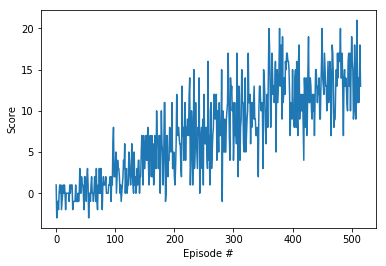

# Navigation Project Report: Solving Banana Collector Environment with Deep Q-Network

## Overview

This report describes implementation of my solution to the Banana Collector environment as part of the Navigation Project from Udacity Deep Reinforcement Learning Nanodegree.

My solution implements a deep Q-network (DQN) agent with the following enhancements:

- Prioritized Experience Replay
- Fixed Q-targets
- Double DQN

It is based on the following papers:

- **DQN**: Mnih, Volodymyr, et al. "Human-level control through deep reinforcement learning." Nature 518.7540 (2015): 529.
- **Prioritized Experience Replay**: Schaul, Tom, et al. "Prioritized experience replay." arXiv preprint arXiv:1511.05952 (2015).
- **Double DQN**: Van Hasselt, Hado, Arthur Guez, and David Silver. "Deep Reinforcement Learning with Double Q-Learning." AAAI. Vol. 2. 2016.

Implementation is done in Python using PyTorch. Documented code is provided in Navigation_DQN.ipynb.

## Learning Algorithm

The main part of the solution is the DQN agent implemented in `PriorityDoubleDQNAgent` class.
This agent uses prioritized replay memory implemented in `PriorityReplayMemory` class. 
It also implements fixed Q-targets and Double DQN which require two Q-networks with the same structure:
online Q-network for choosing actions and target Q-network used for learning to avoid harmful correlations 
and overestimation of the action values.

Training of the agent is implemented in the `train` function, which has the following flow:

1. Every timestep observation of the environment (state) is provided to the agent and the agent selects the action (`act` method).
2. Then, the next state of the environment is observed and the reward is received, e.g. +1 for collected yellow banana. 
We also get the information whether the episode is completed (done).
3. State, action, next state and the reward constitute the experience used to the agent for learning.
The agent adds this experience to its replay memory (`percieve` method) and when there are enough 
experiences collected it starts learning (`learn` method).
 
Learning with the prioritized experience replay, fixed Q-targets and Double DQN happens as follows:

1. A batch of experiences is sampled from the replay memory.
2. For each experience, the next action for the next state is selected to maximize the Q-values estimated from 
the online Q-network.
3. Target Q-values for the current state and action are computed as the sum of the reward and the estimated Q-value from 
the target Q-network for the next state and the action selected in the previous step.
3. Expected Q-values for the current state is estimated from the online Q-network.
4. Temporal difference errors (TD-error) are computed as the difference between the target and expected Q-values.
5. Mean squares error loss is computed for the TD-errors.
6. Parameters of the online Q-network are updated by minimizing the loss through backpropagation
7. Parameters for the target Q-network are updated with the weighted sum of the target and online parameters.
9. Priorities of the sampled experiences are updated based on the TD-errors.

This description omits some details associated with prioritized expereince replay and the use of hyperpaprameters, 
which are described in the next sections 

## Prioritized Experience Replay

The goal of prioritized experience replay is to learn more from difficult experiences.
It is achieved by increasing sampling probability for experiences with higher TD-error.
The original paper suggests two implementations of the replay memory: 
one based on using TD-errors as the priority directly and another uses the rank of the experiences in the list sorted by the priority. 
As indicated by the original paper, both achieve similar performance.
Current solution implements the rank-based approach, where experiences are sampled from a sorted list with higher probability 
of sampling from the beginning of the list.

Two optimizations are applied to reduce the cost of maintaining a sorted list. 
First, a binary heap is used to maintain the list in approximately sorted order.
Second, the list is divided into a number of segments corresponding to the batch size (number of experiences to sample).
One experience per segment is selected uniformly during sampling.
Sizes of segments vary from smaller segments at the beginning of the list to larger segments toward the end.
This difference in sizes makes it so that experiences in the beginning of the list have higher chance to be sampled than towards the end.

In addition to sampled experiences, sampling also computes importance-sampling weights, 
which are used in the learning process to compensate for the skew in distribution of experiences presented to the q-network.

## Q-network architecture

Q-network maps state to Q-values for each action. 
Current implementation uses a dense neural network with two hidden layers where each layer has 64 nodes with 
rectified linear unit activation function. 
In addition, I added batch normalization, which might result in faster learning.
The complete architecture is as follows:
 
- Input: 37 nodes (state size)
- Hidden layer 1: 64 nodes
    - Batch normalization
    - Rectified linear unit activation 
- Hidden layer 2: 64 nodes
    - Batch normalization
    - Rectified linear unit activation
- Output layer: 4 nodes (number of actions)

## Hyperparameters

| Hyperparameter | Value | Description |
|---|---:|---|
| Replay memory size | 100000 | Maximum size of experience replay memory |
| Replay batch size | 32 | Number of experiences sampled in one batch |
| Replay priority exponent | 0.5 | Influence of the priority on sampling probability |
| Replay sort frequency | 1000 | Number of added or updated experiences before resorting |
| Replay start | 500 | Number of experiences added to the replay memory before starting learning |
| Replay sample exponent start | 0 | Start value for the sampling exponent used in computing sampling weights |
| Replay sample exponent end | 0.5 | End value for the sampling exponent used in computing sampling weights |
| Q-network hidden sizes | 64, 64 | Number of nodes in hidden layers of the Q-networks |
| Learning frequency | 4 | Number of steps between learning occurs |
| Learning  rate | 0.0005 | Controls parameters update of the online Q-network |
| Discount factor | 0.99 | Discount rate for future rewards |
| Target update freq | 1 | Number of learning steps between parameter updates of the target Q-network |
| Soft update factor | 0.001 | Controls parameters update of the target Q-network from the online Q-network |
| Epsilon start | 1.0 | Start value for the epsilon parameter in epsilon-greedy strategy |
| Epsilon end | 0.01 | Final value for the epsilon parameter in epsilon-greedy strategy |
| Epsilon decay | 0.995 | Decrease of the epsilon parameter in epsilon-greedy strategy |

Values for the hyperparameters were obtained from the papers and then tweaked based on the results of several runs, 
however not a systematic way due to the time it takes to train the agent multiple times.

## Results

The agent was able to solve the environment by achieving score of 13 over 100 consecutive episodes after 416 episodes.

Rewards plot:

Video of the solution demo:

## Future work

1. A more systematic way of searching of optimal values for hyperparameters, 
e.g. grid search, random search, bayesian optimization or genetic algorithm
2. Implementing other extensions of DQN, 
e.g. Dueling DQN, multi-strap bootstrap targets, distributional DQN, Noisy DQN

